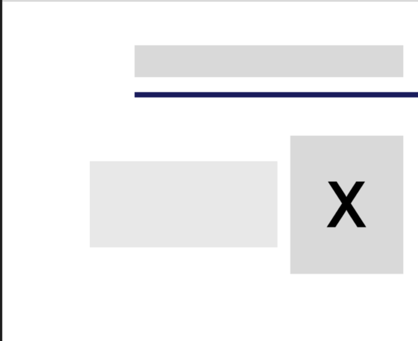
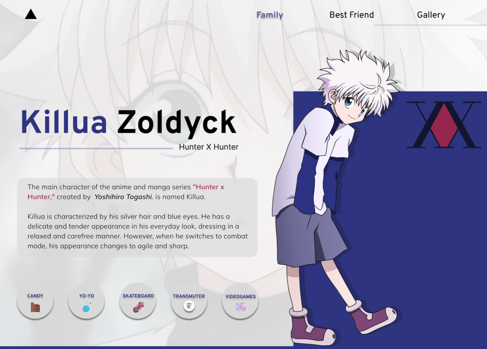

<h1>Killua Zoldyck's Wiki</h1>

<section>
  <h2>Description</h2>
  
Welcome to the Killua Zoldyck Wiki, where you'll find detailed information about one of the most prominent characters from the "Hunter x Hunter" manga and anime, based on the 2011 anime adaptation. Killua Zoldyck is a member of the infamous Zoldyck assassin family and a close friend of the protagonist, Gon Freecss. This Wiki is designed to provide comprehensive information about his background, abilities, relationships, and much more.

</section>

<section>
  <h2>Highlighted Content</h2>
  <ul>
    <li>Biography: Discover Killua's background story, his childhood within the Zoldyck family, and his relationships with family members.</li>
    <li>Abilities: Explore Killua's unique skills, including his prowess as an assassin and his mastery of Nen.</li>
    <li>Relationships: Get to know Killua's best friend.</li>
    <li>Training: Read about his training journey.</li>
    <li>Gallery: Enjoy a collection of images and artwork related to Killua.</li>
  </ul>
</section>

<section>
  <h2>Contribute</h2>
  
If you're a Killua fan and want to contribute to this Wiki, we're delighted to receive your help! You can contribute in the following ways:

  <ul>
    <li><b>Edit Content or Add New Content</b>: If you come across incorrect or incomplete information while browsing the website, feel free to edit and improve existing pages. Additionally, if you want to add a specific topic related to Killua, you can create a new page for it, and we'll gladly include your link.</li>
    <li><b>Corrections and Improvements</b>: If you believe the design and appearance of the Wiki can be enhanced, please let us know, and your suggestions may be considered.</li>
  </ul>
  
<em>Contributing through code makes us part of a certain family</em>, so please do so respectfully and in accordance with the creator's coding guidelines.

</section>

<section>
  <article>
    <h2>How to Use</h2>
    
You can navigate the Wiki using the navigation bar at the top if you're on a PC. Use the button with the house icon, located in the bottom right, to open the menu and select your next destination.

  </article>
</section>

<h2>Page Layout</h2>

<article>
  <h2 align="center">Platform Description</h2>
  <ul>
    <li><b>1. HOME:</b> The home section stores everything related to a brief description of our main character, the manga creator. It also shows us certain abilities that Killua develops over the years. Additionally, it highlights the manga situations that were vital to his training, and last but not least, his favorite word.</li>
    <li><b>2. FAMILY:</b> This sub-page of the wiki focuses on important aspects of the family. I describe each of the most relevant Zoldyck family members (in my opinion) and share a bit about Killua's relationship with his only sister.</li>
    <li><b>3. BEST FRIEND:</b> We dedicate an entire page to the friendship relationship that our character Killua has with the main character.</li>
    <li><b>4. GALLERY:</b> Finally, we create a small but beautiful gallery of Killua.</li>
  </ul>
</article>
<article>
  <h2 align="center">Relevant Technologies</h2>
  <ul>
    <li>User Interface (UI) / User Experience (UX) Design with Figma</li>
    <li>HTML / CSS / JavaScript</li>
    <li>Framework: Bootstrap</li>
    <li>Text Editor: Visual Studio Code</li>
  </ul>
</article>
<article></article>

<section>
    <h2>Credits</h2>
    
This Killua Zoldyck Wiki was created by Cristina Jerez, for and by "Hunter x Hunter" fans. We thank Yoshihiro Togashi for creating this incredible character and the community for their continuous support.

    
The information presented on this page can be found on the web and was also taken from the anime itself, being specific in locations, names, adventures, descriptions, among others.

</section>

<section>
    <h2 align="center">User Interface Design</h2>
    
In this project, we have placed significant emphasis on user interface (UI) design to create a visually appealing and user-friendly experience for our users. Here are some key aspects of the UI design we have considered:

<h4 align="center">Color Palette</h4>
    
I have selected the color palette based on Killua's attire, highlighting its purple shades. The chosen colors are:

    <ul>
        <li>Main Color: #2E347fF</li>
        <li>Secondary Color: #754571</li>
        <li>Background Color: #2E347fF</li>
        <li>Text Color: #000000</li>
    </ul>
     

<h4 align="center">Typography</h4>
    
I have chosen two fonts that stand out and are easy to read for any reader, enhancing the reading experience. The fonts used are:

    <ul>
        <li>Title: "Overpass"</li>
        <li>Text: "Mulish"</li>
    </ul>
    
These fonts are obtained by importing the files from Google Fonts, and the sans-serif font family is used as a fallback option in case the browser doesn't have the specified fonts.

<h4 align="center">Images and Icons</h4>
    
Regarding the images used, I can speak in general that I obtained them from the internet. I have added a file (Info.txt) where you can find the majority of the images. For the HOME icon, I also used those offered by Google Icons.

</section>
<section>
    <h2 align="center">Designs</h2>
    <h3 align="center">Mobile-First Model</h3>
    <article>
        <b>Navigation Bar</b>
        

        

    </article>  
    <article>
        <b>HOME</b>
        

        

        

        

        

    </article>  
    <article>
        <b>FAMILY</b>
        

        

        

    </article>  
    <article>
        <b>BEST FRIEND</b>
        

        

    </article>  
    <article>
        <b>GALLERY</b>
        

        

    </article>
    <article>
        <b>Footer</b>
        

        

    </article>

<h3 align="center">Desktop Model</h3>
    <article>
        <b>HOME</b>
        

        

        

        

    </article>  
    <article>
        <b>FAMILY</b>
        

        

        

    </article>  
    <article>
        <b>BEST FRIEND</b>
        

        

    </article>  
    <article>
        <b>GALLERY</b>
        

        

    </article>
    <article>
        <b>Footer</b>
        

        

    </article>
</section>

<footer>
    
I hope you enjoy exploring the life of Killua Zoldyck on this Wiki! If you have any questions, comments, or suggestions, please feel free to reach out to me on any of my social media platforms, and I'll be happy to address your concerns.

    
[ * Instagram](https://www.instagram.com/criistiinasalas/)

    
[ * Github - JCristinaJSalas](https://github.com/JCristinaJSalas)

    
*Gmail: criistiinajerez@gmail.com

</footer>

